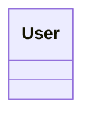
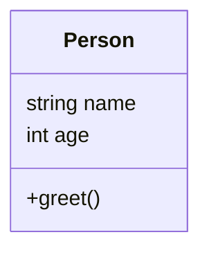
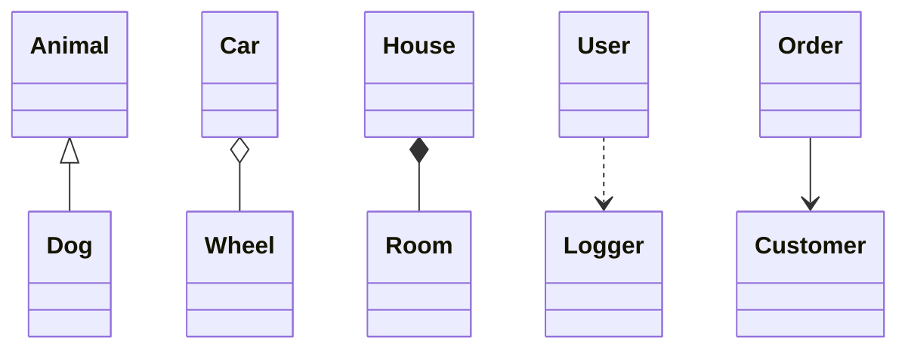
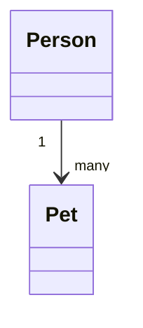
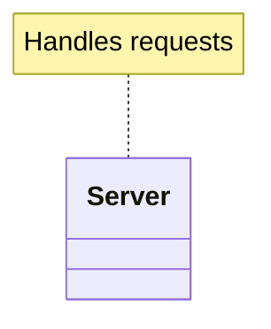

# Mermaid Class Diagram Guide (Obsidian)

> [!Documentation]
> [Class diagrams | Mermaid](https://mermaid.js.org/syntax/classDiagram.html)

## Minimal Class

## Class With Fields & Methods

## Relationships
- Inheritance: `A <|-- B`
- Association: `A --> B`
- Aggregation: `A o-- B`
- Composition: `A *-- B`
- Dependency: `A ..> B`

## Multiplicity

## Notes

