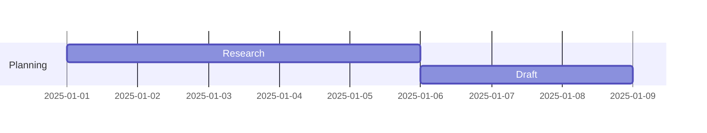
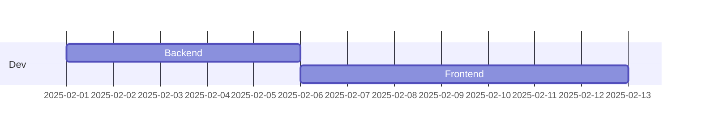
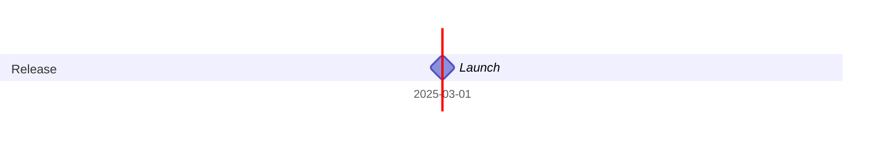
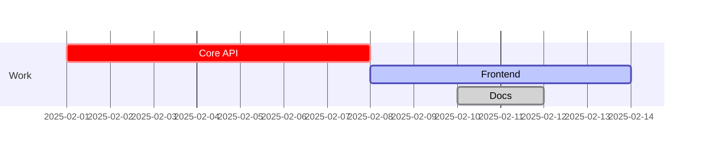

# Mermaid Gantt Diagram Guide (Obsidian)
> [!NOTE] Documentation
> [Gantt diagrams | Mermaid](https://mermaid.js.org/syntax/gantt.html)
## Minimal Setup
```mermaid
gantt
  title Project Plan
  dateFormat YYYY-MM-DD
```

## Sections & Tasks
Syntax: `TaskName :id, start, duration`



## Dependencies


## Milestones


## Task States
- `crit`
- `active`
- `done`


TODO
**Forberedelse**
- Repo (GitHub)
- Læse opgaveformulering sammen
- Obsidian opsætning
- Projektplanlægning
- Konktrakt?
- GANTT

**Ideudvikling**
- Udarbejd problemformulering
- Konceptbeskrivelse
- Fælles orbog

**Forretningsforståelse**
- BMC
- ESG (par linjer)

**Kravspecifikation**
- User stories
- FURPS+

**Artefakter**
- Sekvensdiagrammer
- klassediagrammer
- use case
- domænemodel
- vision board

**UX/UI**

**Implementering**
  - Medlemskab
  - Oprettelse af aktiviteter med mulighed for begrænsning af antal deltagere
  - Tilmelding til aktiviteter
  - Overblik over aktiviteter (for både medlemmer og administratorer)
  - Data indlæses fra en fil med **mindst 10 medlemmer**


**Rapport**
- Forside (se krav)
- Indholdsfortegnelse
- Indledning og problemformulering