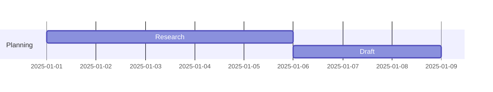
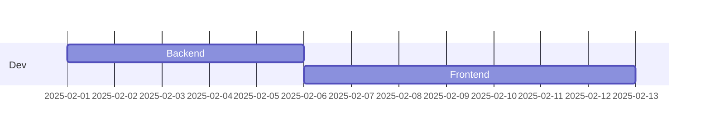
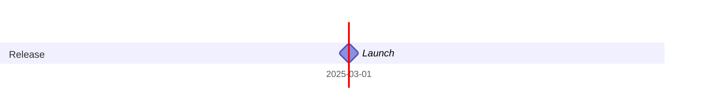

# Mermaid Gantt Diagram Guide (Obsidian)
> [!NOTE] Documentation
> [Gantt diagrams | Mermaid](https://mermaid.js.org/syntax/gantt.html)
## Minimal Setup
```mermaid
gantt
  title Project Plan
  dateFormat YYYY-MM-DD
```

## Sections & Tasks
Syntax: `TaskName :id, start, duration`



## Dependencies


## Milestones


## Task States
- `crit`
- `active`
- `done`

```mermaid
gantt
    dateFormat  YYYY-MM-DD
    title Projektoversigt

    section Forberedelse
    Repo opsætning            :a1, 2025-11-18, 1d
    Læs opgaveformulering     :a2, after a1, 1d
    Obsidian opsætning        :a3, after a2, 1d
    Projektplanlægning        :a4, after a3, 1d
    Gantt                     :a5, after a4, 1d
    Ideudvikling              :a7, after a5, 2d

    section Problemrum
    Problemformulering        :b1, after a7, 2d
    Konceptbeskrivelse        :b2, after b1, 2d
    Ordbog                    :b3, after b2, 1d
    Forretningsforståelse     :b4, after b3, 1d

    BMC Key Partners          :b5, after b4, 1d
    BMC Key Activities        :b6, after b5, 1d
    BMC Key Resources         :b7, after b6, 1d
    BMC Value Proposition     :b8, after b7, 1d
    BMC Customer Segments     :b9, after b8, 1d
    BMC Channels              :b10, after b9, 1d
    BMC Customer Relations    :b11, after b10, 1d
    BMC Cost Structure        :b12, after b11, 1d
    BMC Revenue Streams       :b13, after b12, 1d

    ESG tekst                 :b14, after b13, 1d
    Kravspecifikation         :b15, after b14, 1d
    User Stories              :b16, after b15, 1d
    FURPS+                    :b17, after b16, 1d
    Artefakter                :b18, after b17, 1d

    section UML / Design
    Use Cases                 :c1, after b18, 1d
    Sekvensdiagrammer         :c2, after c1, 1d
    Klassediagram             :c3, after c2, 1d
    Domænemodel               :c4, after c3, 1d
    Vision board              :c5, after c4, 1d
    UX/UI skitser             :c6, after c5, 2d

    section Implementering
    Medlemskabssystem         :d1, after c6, 2d
    Opret aktiviteter         :d2, after d1, 2d
    Tilmelding                :d3, after d2, 2d
    Aktivitetsoverblik        :d4, after d3, 2d
    Admin overblik            :d5, after d4, 2d
    Data indlæsning fra fil   :d6, after d5, 1d
    Funktionelle tests        :d7, after d6, 2d

    section Rapport
    Forside                   :e1, after d7, 1d
    Indholdsfortegnelse       :e2, after e1, 1d
    Indledning                :e3, after e2, 1d
    Metode (OOA/OOD)          :e4, after e3, 1d
    Design/UML afsnit         :e5, after e4, 1d
    Implementering afsnit     :e6, after e5, 1d
    Test afsnit               :e7, after e6, 1d
    Konklusion                :e8, after e7, 1d
```
TODO
**Forberedelse**
- Repo (GitHub)
- Læse opgaveformulering sammen
- Obsidian opsætning
- Projektplanlægning
- Konktrakt?
- GANTT

**Ideudvikling**
- Udarbejd problemformulering
- Konceptbeskrivelse
- Fælles orbog

**Forretningsforståelse**
- BMC
- ESG (par linjer)

**Kravspecifikation**
- User stories
- FURPS+

**Artefakter**
- Sekvensdiagrammer
- klassediagrammer
- use case
- domænemodel
- vision board

**UX/UI**

**Implementering**
  - Medlemskab
  - Oprettelse af aktiviteter med mulighed for begrænsning af antal deltagere
  - Tilmelding til aktiviteter
  - Overblik over aktiviteter (for både medlemmer og administratorer)
  - Data indlæses fra en fil med **mindst 10 medlemmer**


**Rapport**
- Forside (se krav)
- Indholdsfortegnelse
- Indledning og problemformulering