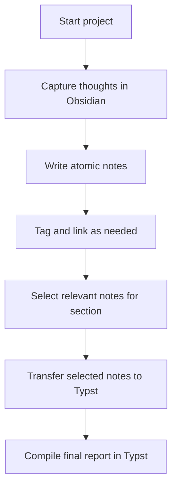
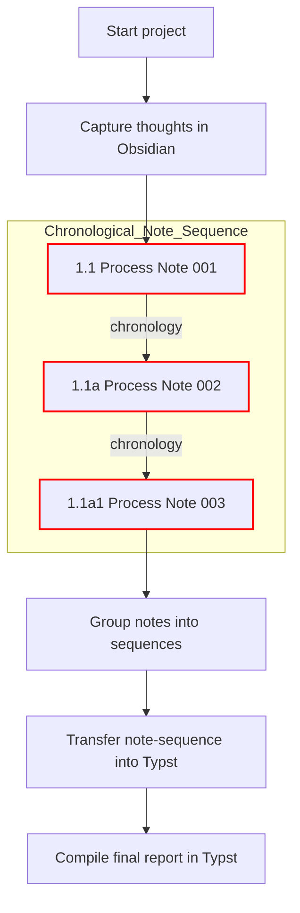

# Flow 1

```mermaid
flowchart TD
    A[Start project] --> B[Capture thoughts in Obsidian]
    B --> C[Write atomic notes]
    C --> D[Tag and link as needed]
    D --> E[Select relevant notes for section]
    E --> F[Transfer selected notes to Typst]
    F --> G[Compile final report in Typst]

```
# Flow 2

```mermaid
flowchart TD
    A[Start project] --> B[Capture thoughts in Obsidian]

    subgraph Chronological_Note_Sequence
        direction TB
        N1["1.1 Process Note 001"]:::chron
        N2["1.1a Process Note 002"]:::chron
        N3["1.1a1 Process Note 003"]:::chron
    end

    B --> N1
    N1 -->|chronology| N2
    N2 -->|chronology| N3

    N3 --> C[Group notes into sequences]
    C --> D[Transfer note-sequence into Typst]
    D --> E[Compile final report in Typst]

    classDef chron stroke:#ff0000,stroke-width:2px;

```