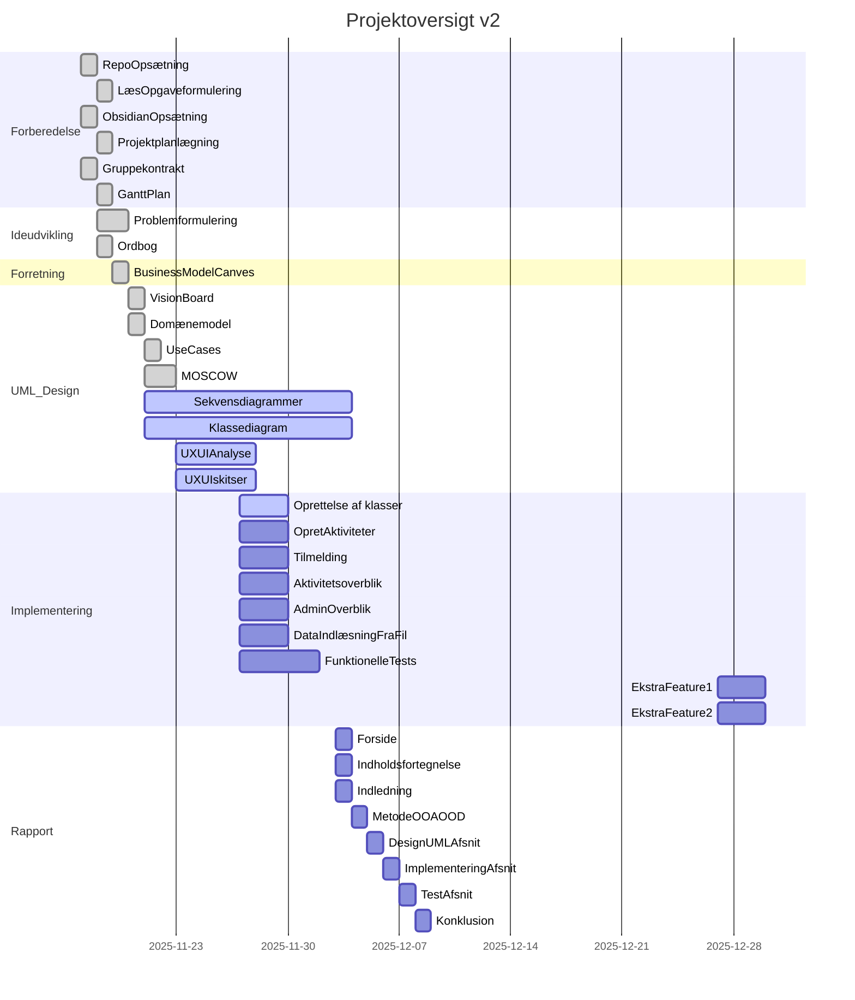
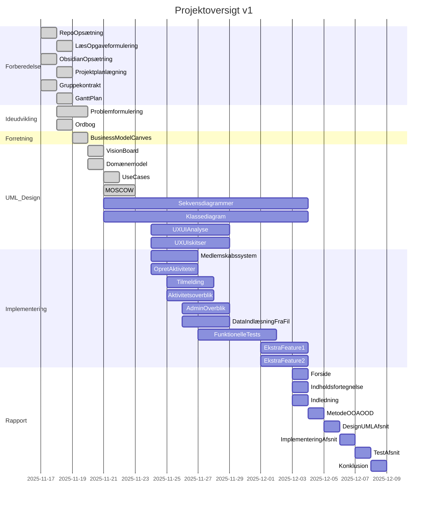

```mermaid
gantt
    dateFormat  YYYY-MM-DD
    title Projektoversigt v2

    section Forberedelse
    RepoOpsætning          :done, a1, 2025-11-17, 1d
    LæsOpgaveformulering   :done, a2, 2025-11-18, 0.5d
    ObsidianOpsætning      :done, a3, 2025-11-17, 1d
    Projektplanlægning     :done, a4, 2025-11-18, 1d
    Gruppekontrakt         :done, a5, 2025-11-17, 0.5d
    GanttPlan              :done, a6, 2025-11-18, 1d
   
    section Ideudvikling
    Problemformulering       :done, b1, 2025-11-18, 2d
    Ordbog                   :done, b3, 2025-11-18, 1d

    
	section Forretning
    BusinessModelCanves     :done, c1, 2025-11-19, 1d

    section UML_Design
    VisionBoard             :done, d1, 2025-11-20, 0.5d
    Domænemodel             :done, d2, 2025-11-20, 0.5d
    UseCases                :done, d5, 2025-11-21, 0.5d
    MOSCOW                  :done, d6, 2025-11-21, 2d
    Sekvensdiagrammer       :active, d7, 2025-11-21, 13d
    Klassediagram           :active, d8, 2025-11-21, 13d
    UXUIAnalyse            :active, d9, 2025-11-23, 5d
    UXUIskitser            :active, d10, 2025-11-23, 5d

    section Implementering
    Oprettelse af klasser     :active, e1, 2025-11-27, 3d
    OpretAktiviteter        :e2, 2025-11-27, 3d
    Tilmelding               :e3, 2025-11-27, 3d
    Aktivitetsoverblik       :e4, 2025-11-27, 3d
    AdminOverblik           :e5, 2025-11-27, 3d
    DataIndlæsningFraFil :e6, 2025-11-27, 3d
    FunktionelleTests       :e7, 2025-11-27, 5d
    EkstraFeature1           :e8, 2025-12-27, 3d
    EkstraFeature2           :e9, 2025-12-27, 3d

    section Rapport
    Forside                  :f1, 2025-12-03, 1d
    Indholdsfortegnelse      :f2, 2025-12-03, 1d
    Indledning               :f3, 2025-12-03, 1d
    MetodeOOAOOD           :f4, 2025-12-04, 1d
    DesignUMLAfsnit        :f5, 2025-12-05, 1d
    ImplementeringAfsnit    :f6, 2025-12-06, 1d
    TestAfsnit              :f7, 2025-12-07, 1d
    Konklusion               :f8, 2025-12-08, 1d
```

```mermaid
gantt
    dateFormat  YYYY-MM-DD
    title Projektoversigt v1

    section Forberedelse
    RepoOpsætning          :done, a1, 2025-11-17, 1d
    LæsOpgaveformulering   :done, a2, 2025-11-18, 0.5d
    ObsidianOpsætning      :done, a3, 2025-11-17, 1d
    Projektplanlægning     :done, a4, 2025-11-18, 1d
    Gruppekontrakt         :done, a5, 2025-11-17, 0.5d
    GanttPlan              :done, a6, 2025-11-18, 1d
   
    section Ideudvikling
    Problemformulering       :done, b1, 2025-11-18, 2d
    Ordbog                   :done, b3, 2025-11-18, 1d

    
	section Forretning
    BusinessModelCanves     :done, c1, 2025-11-19, 1d

    section UML_Design
    VisionBoard             :done, d1, 2025-11-20, 0.5d
    Domænemodel             :done, d2, 2025-11-20, 0.5d
    UseCases                :done, d5, 2025-11-21, 0.5d
    MOSCOW                  :done, d6, 2025-11-21, 2d
    Sekvensdiagrammer       :d7, 2025-11-21, 13d
    Klassediagram           :d8, 2025-11-21, 13d
    UXUIAnalyse            :d9, 2025-11-24, 5d
    UXUIskitser            :d10, 2025-11-24, 5d

    section Implementering
    Medlemskabssystem        :e1, 2025-11-24, 3d
    OpretAktiviteter        :e2, 2025-11-24, 3d
    Tilmelding               :e3, 2025-11-25, 3d
    Aktivitetsoverblik       :e4, 2025-11-25, 3d
    AdminOverblik           :e5, 2025-11-26, 3d
    DataIndlæsningFraFil :e6, 2025-11-26, 3d
    FunktionelleTests       :e7, 2025-11-27, 5d
    EkstraFeature1           :e8, 2025-12-01, 3d
    EkstraFeature2           :e9, 2025-12-01, 3d

    section Rapport
    Forside                  :f1, 2025-12-03, 1d
    Indholdsfortegnelse      :f2, 2025-12-03, 1d
    Indledning               :f3, 2025-12-03, 1d
    MetodeOOAOOD           :f4, 2025-12-04, 1d
    DesignUMLAfsnit        :f5, 2025-12-05, 1d
    ImplementeringAfsnit    :f6, 2025-12-06, 1d
    TestAfsnit              :f7, 2025-12-07, 1d
    Konklusion               :f8, 2025-12-08, 1d
```

