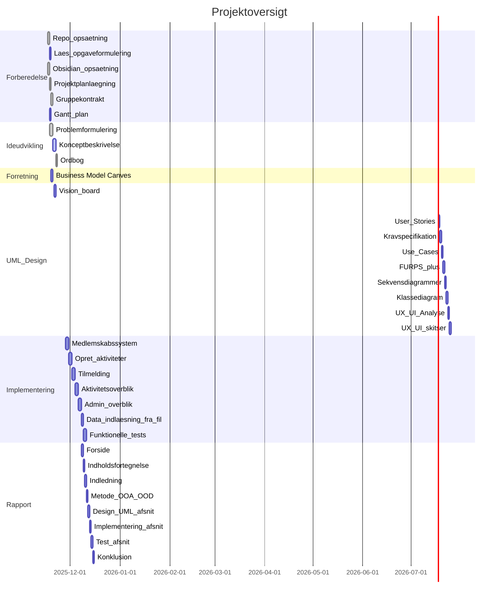
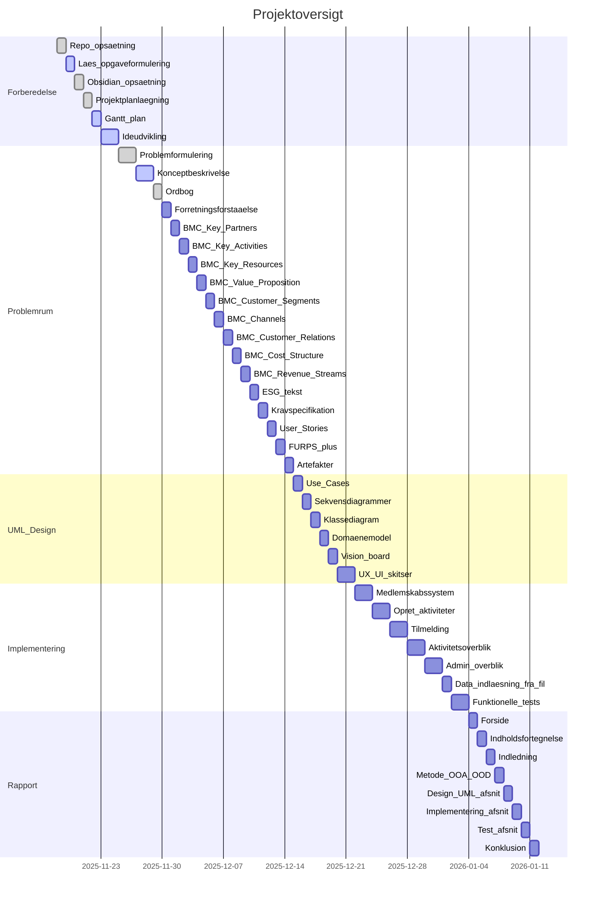

```mermaid
gantt
    dateFormat  YYYY-MM-DD
    title Projektoversigt

    section Forberedelse
    Repo_opsaetning          :done, a1, 2025-11-17, 1d
    Laes_opgaveformulering   :active, a2, after a1, 0.5d
    Obsidian_opsaetning      :done, a3, 2025-11-17, 1d
    Projektplanlaegning      :done, a4, after a3, 1d
    Gruppekontrakt           :done, a5, after a4, 0.5d
    Gantt_plan               :active, a6, 2025-11-18, 1d
   
    section Ideudvikling
    Problemformulering       :done, b1, 2025-11-18, 2d
    Konceptbeskrivelse       :active, b2, after b1, 2d
    Ordbog                   :done, b3, after b2, 1d

    
	section Forretning
    Business Model Canves    :c1, 2025-11-19, 1d

    section UML_Design
    Vision_board             :d1, 2025-11-21, 0.5d
    Domaenemodel             :d2, after d2, 0.5d
    User_Stories             :d4, after d3, 0.5d
    Kravspecifikation        :d5, after d4, 0.5d
    Use_Cases                :d6, after d5, 0.5d
    FURPS_plus               :d7, after d6, 0.5d
    Sekvensdiagrammer        :d8, after d7, 0.5d
    Klassediagram            :d9, after d8, 1d
    UX_UI_Analyse            :d10, after d9, 0.5d
    UX_UI_skitser            :d11, after d10, 0.5d

    section Implementering
    Medlemskabssystem        :e1, 2025-11-28, 2d
    Opret_aktiviteter        :e2, after e1, 2d
    Tilmelding               :e3, after e2, 2d
    Aktivitetsoverblik       :e4, after e3, 2d
    Admin_overblik           :e5, after e4, 2d
    Data_indlaesning_fra_fil :e6, after e5, 1d
    Funktionelle_tests       :e7, after e6, 2d

    section Rapport
    Forside                  :f1, 2025-12-08, 0.5d
    Indholdsfortegnelse      :f2, after f1, 0.5d
    Indledning               :f3, after f2, 0.5d
    Metode_OOA_OOD           :f4, after f3, 0.5d
    Design_UML_afsnit        :f5, after f4, 0.5d
    Implementering_afsnit    :f6, after f5, 0.5d
    Test_afsnit              :f7, after f6, 0.5d
    Konklusion               :f8, after f7, 0.5d
```

```mermaid
gantt
    dateFormat  YYYY-MM-DD
    title Projektoversigt

    section Forberedelse
    Repo_opsaetning          :done, a1, 2025-11-18, 1d
    Laes_opgaveformulering   :active, a2, after a1, 1d
    Obsidian_opsaetning      :done, a3, after a2, 1d
    Projektplanlaegning      :done, a4, after a3, 1d
    Gantt_plan               :active, a5, after a4, 1d
    Ideudvikling             :active, a6, after a5, 2d

    section Problemrum
    Problemformulering       :done, b1, after a6, 2d
    Konceptbeskrivelse       :active, b2, after b1, 2d
    Ordbog                   :done, b3, after b2, 1d
    Forretningsforstaaelse   :b4, after b3, 1d

    BMC_Key_Partners         :b5, after b4, 1d
    BMC_Key_Activities       :b6, after b5, 1d
    BMC_Key_Resources        :b7, after b6, 1d
    BMC_Value_Proposition    :b8, after b7, 1d
    BMC_Customer_Segments    :b9, after b8, 1d
    BMC_Channels             :b10, after b9, 1d
    BMC_Customer_Relations   :b11, after b10, 1d
    BMC_Cost_Structure       :b12, after b11, 1d
    BMC_Revenue_Streams      :b13, after b12, 1d

    ESG_tekst                :b14, after b13, 1d
    Kravspecifikation        :b15, after b14, 1d
    User_Stories             :b16, after b15, 1d
    FURPS_plus               :b17, after b16, 1d
    Artefakter               :b18, after b17, 1d

    section UML_Design
    Use_Cases                :c1, after b18, 1d
    Sekvensdiagrammer        :c2, after c1, 1d
    Klassediagram            :c3, after c2, 1d
    Domaenemodel             :c4, after c3, 1d
    Vision_board             :c5, after c4, 1d
    UX_UI_skitser            :c6, after c5, 2d

    section Implementering
    Medlemskabssystem        :d1, after c6, 2d
    Opret_aktiviteter        :d2, after d1, 2d
    Tilmelding               :d3, after d2, 2d
    Aktivitetsoverblik       :d4, after d3, 2d
    Admin_overblik           :d5, after d4, 2d
    Data_indlaesning_fra_fil :d6, after d5, 1d
    Funktionelle_tests       :d7, after d6, 2d

    section Rapport
    Forside                  :e1, after d7, 1d
    Indholdsfortegnelse      :e2, after e1, 1d
    Indledning               :e3, after e2, 1d
    Metode_OOA_OOD           :e4, after e3, 1d
    Design_UML_afsnit        :e5, after e4, 1d
    Implementering_afsnit    :e6, after e5, 1d
    Test_afsnit              :e7, after e6, 1d
    Konklusion               :e8, after e7, 1d
```
