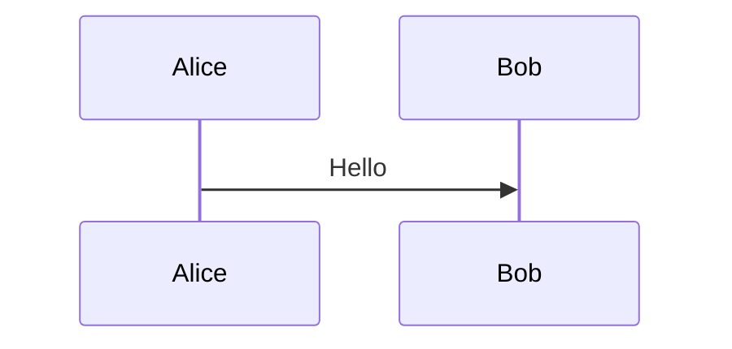
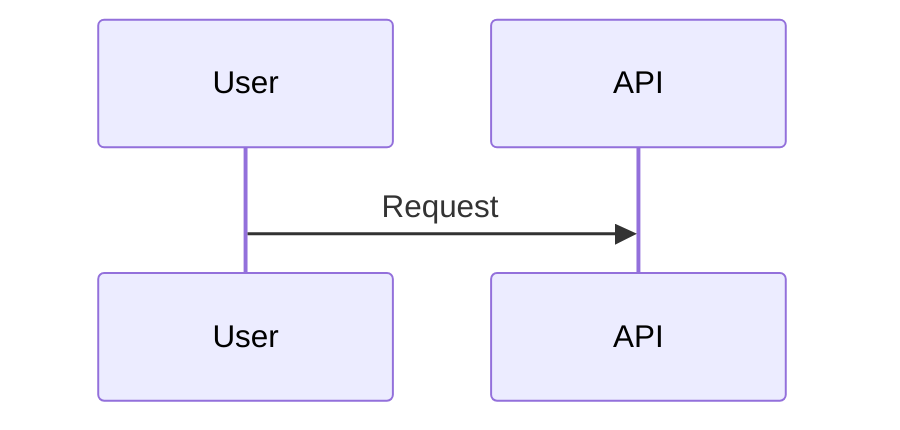
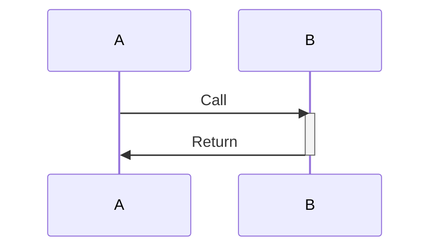
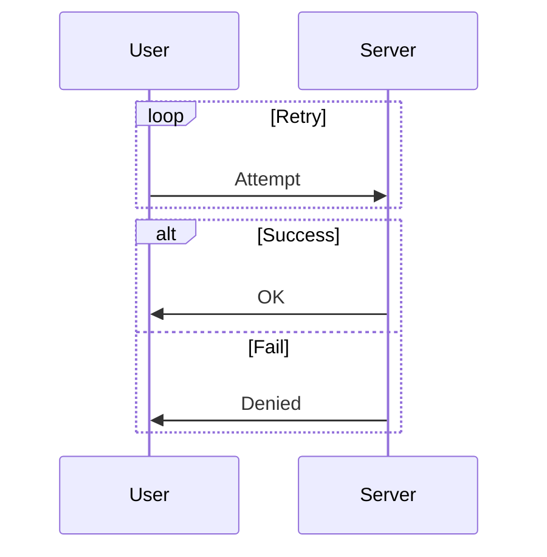
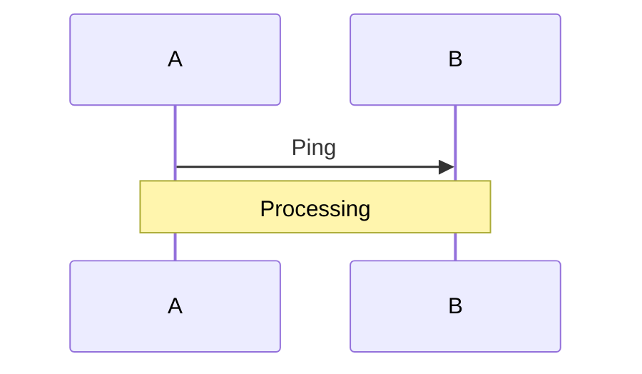

# Mermaid Sequence Diagram Guide (Obsidian)
> [!NOTE] Documentation
> [Sequence diagrams | Mermaid](https://mermaid.js.org/syntax/sequenceDiagram.html)
## Minimal Exchange


## Arrow Types
- Sync: `A->>B`
- Async: `A-->>B`
- Solid: `A->B`
- Dashed: `A--B`

```mermaid
sequenceDiagram
  A->>B: Sync
  A-->>B: Async
  A->B: Solid
  A--B: Dashed
```

## Participants


## Activation / Deactivation


## Loops & Conditionals


## Notes

