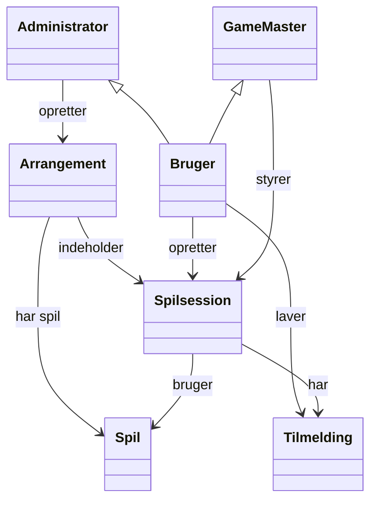

```mermaid
classDiagram

    class Bruger
    class Administrator
    class GameMaster
    class Arrangement
    class Spilsession
    class Spil
    class Tilmelding

    %% Roller
    Administrator <|-- Bruger
    GameMaster <|-- Bruger

    %% Arrangementer
    Administrator --> Arrangement : opretter
    Arrangement --> Spilsession : indeholder
    Arrangement --> Spil : har spil

    %% Spilsession
    Bruger --> Spilsession : opretter
    GameMaster --> Spilsession : styrer
    Spilsession --> Spil : bruger

    %% Tilmelding
    Bruger --> Tilmelding : laver
    Spilsession --> Tilmelding : har

```

# Liste over alle elementer i domænet
- Administrator
- Bruger
- Gamemaster
- Spil
- Bibliotek
- Ansat
- Medlem
- Frivillig
- Arrangement
- Session
- Deltager
- Spiller