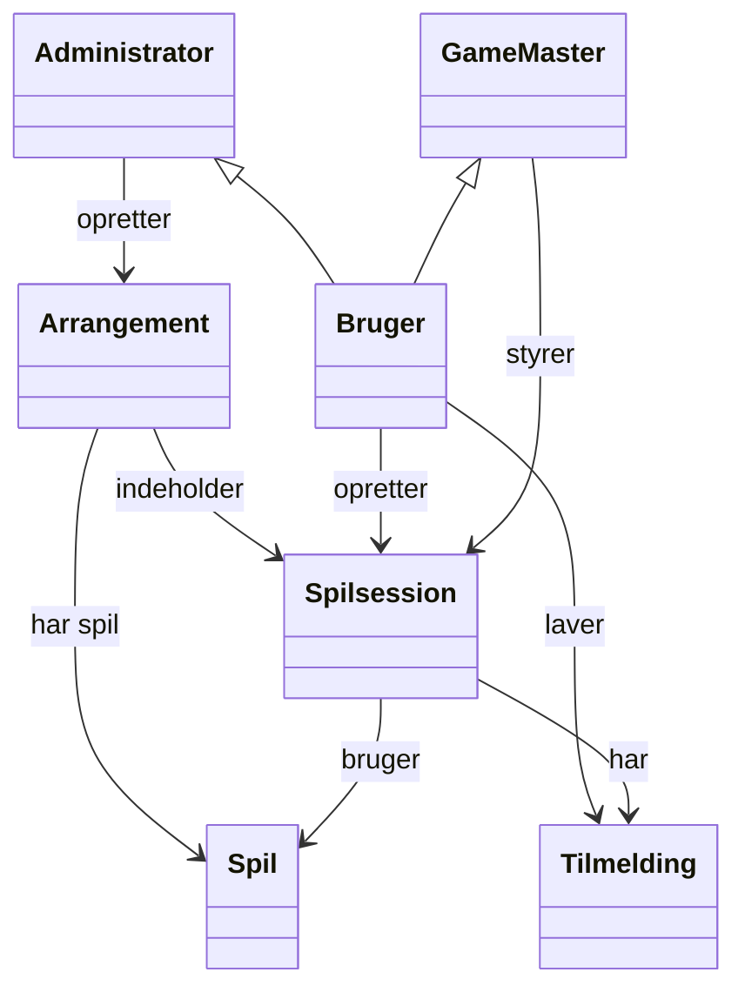
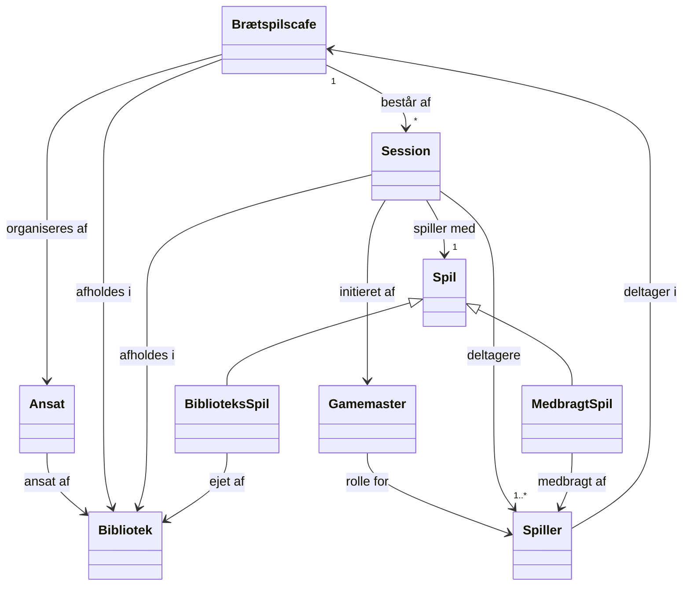

> [!NOTE]- Prompt
> ✔ 1. Med i domænemodellen: ting der eksisterer i virkeligheden
>
> Hvis noget indgår i praksis, workflow, regler, roller eller artefakter i den virkelige verden, så skal det med — uanset om det er digitalt eller ej.
>
> Eksempler:
>
> - En “Reservering” mellem Bruger og Lokale, selv hvis ingen IT-løsning håndterer den endnu.
>
> - “Spilsessioner”, “Materialer”, “Bookingregler” — hvis de findes som begreber i organisationen.
>
> ✔ 2. Med i domænemodellen: ting der ikke eksisterer digitalt endnu, men som er virkelige domænekoncepter
>
> Her gælder: Findes begrebet i forretningens hoved eller praksis?
> Hvis ja → med i domænemodellen.
> Hvis nej → ikke med.
>
> ✘ 3. Ikke med: ting der kun eksisterer fordi systemet har brug for dem (design-artefakter)
>
> Disse hører til designmodellen, ikke domænemodellen:
>
> - “UserDTO”, “BookingController”, “SessionIDGenerator”, “LoginState”
>
> - UI-ting: “Modal”, “ViewModel”, “Screen”
>
> - Implementeringskrav: “Cache”, “API Response”, “Database Table”
>
> Det er tekniske opfindelser — ikke domænekoncepter.


> [!NOTE]- Prompt
> En domænemodel handler om _begreber_, ikke om _stoffer_.
> 
> Derfor modellerer man:
> - **Materielle ting** → fx _Lokale_, _Brætspil_, _Nøglekort_
> - **Immaterielle ting** → fx _Booking_, _Regel_, _Session_, _Rolle_, _Tilladelse_
> - **Hændelser** → fx _Udlån_, _Registrering_, _Ankomst_
> - **Roller** → fx _Bruger_, _Bibliotekar_

Så længe begrebet eksisterer i virkelighedens praksis (om det så er i folks hoveder eller i papir-workflow), hører det hjemme.


# Liste over alle elementer i domænet
- Administrator
- Bruger
- Gamemaster
- Lånte spil
- Medbragte spil
- Bibliotek
- Ansat
- Medlem
- Frivillig
- Arrangement
- Session
- Deltager
- Spiller
- Brugerprofil
# Domænemodel v1


# Domænemodel v2
Har fodret AI med en liste over domæneartefakter og deres generelle relationer.

> [!INFO]- Original script fra AI
> Kilde: https://chatgpt.com/share/6925ae87-f1d0-8011-ab23-f28be48b3c3a
> ```
> classDiagram
> 
> class Bibliotek {
> }
> 
> class Ansat {
>     navn
> }
> Ansat --> Bibliotek : ansat_af
> 
> class Brætspilscafe {
>     dato
>     sted
> }
> Brætspilscafe --> Bibliotek : afholdes_i
> Brætspilscafe --> Ansat : organiseres_af
> Brætspilscafe --> Session : består_af *
> 
> class Spiller {
>     navn
> }
> Spiller --> Brætspilscafe : deltager_i
> 
> class Gamemaster {
> }
> Gamemaster --> Spiller : rolle_for
> 
> class Session {
>     start
>     slut
> }
> Session --> Gamemaster : initieret_af
> Session --> Spiller : deltagere *
> Session --> Spil : spiller_med 1
> Session --> Bibliotek : afholdes_i
> 
> class Spil {
>     titel
> }
> Spil <|-- BiblioteksSpil
> Spil <|-- MedbragtSpil
> 
> class BiblioteksSpil {
> }
> BiblioteksSpil --> Bibliotek : ejet_af
> 
> class MedbragtSpil {
> }
> MedbragtSpil --> Spiller : medbragt_af
> ```


