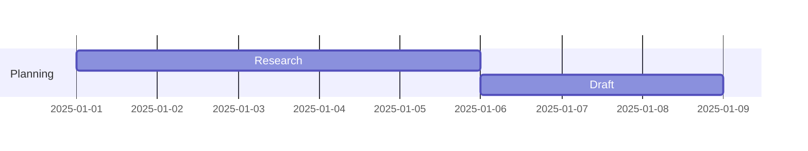
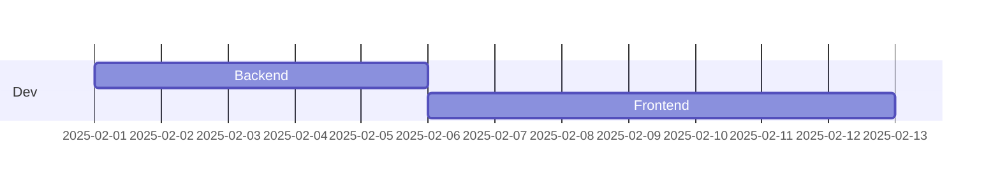
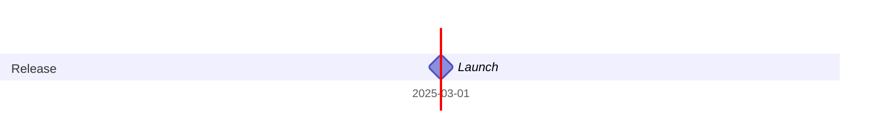
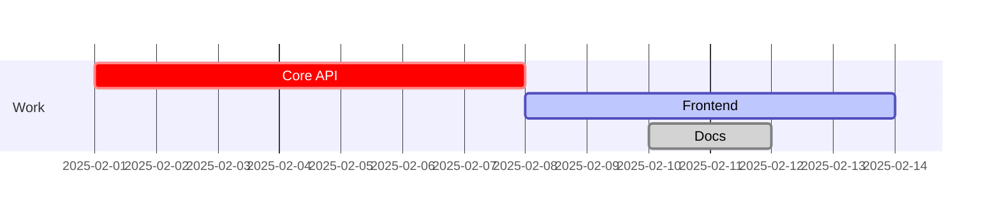

# Mermaid Gantt Diagram Guide (Obsidian)

## Minimal Setup
```mermaid
gantt
  title Project Plan
  dateFormat YYYY-MM-DD
```

## Sections & Tasks
Syntax: `TaskName :id, start, duration`



## Dependencies


## Milestones


## Task States
- `crit`
- `active`
- `done`


