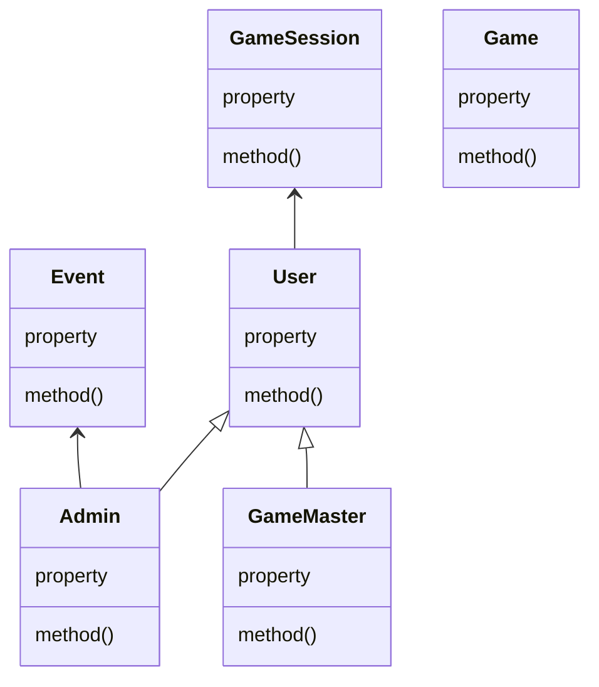

```mermaid
classDiagram

User <|-- Admin
User <|-- GameMaster
Event <-- Admin
GameSession <-- User
		
class User{
	property
    method()}
class Admin{
	property
    method()}
class GameMaster{
	property
    method()}
class Event{
	property
    method()}
class GameSession{
	property
    method()}
class Game{
	property
    method()}
```

Game <-- GameSession
GameSession <-- Event
Event <-- Game
GameSession <|-- GameMaster
Event <-- User