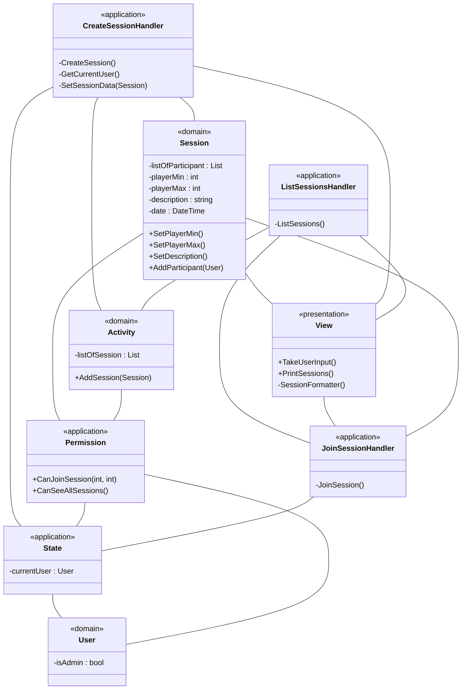
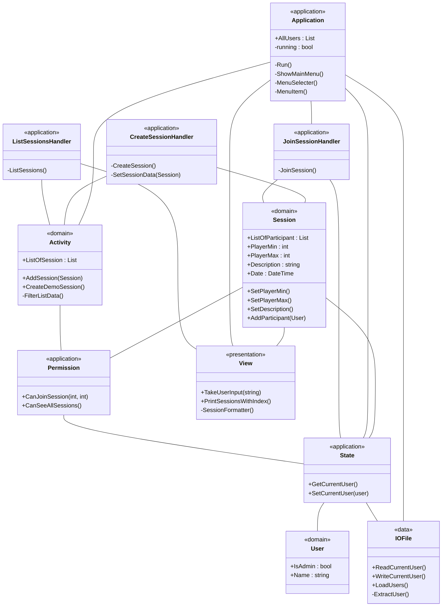

# Version 1

Game <-- GameSession
GameSession <-- Event
Event <-- Game

GameSession <|-- GameMaster
Event <-- User

# Version 2

# Version 3
Vi skærer klassediagrammet helt ind til essentielle features for at kunne opfylde opgavekravene. Se ![[Krav#^9cb3e5]]

# Version 4
Hænger sammen med [[Sekvensdiagram#Version 1]]

# Version 5

# Version 6
