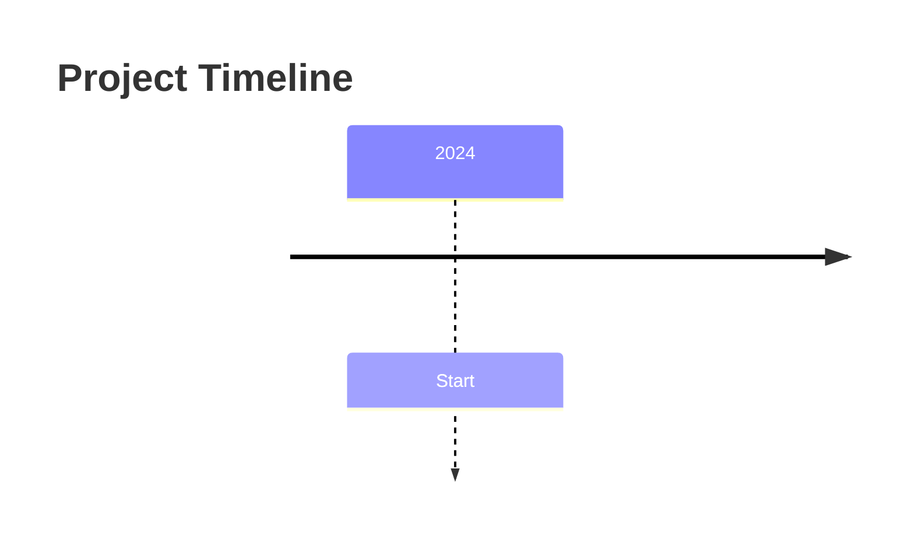
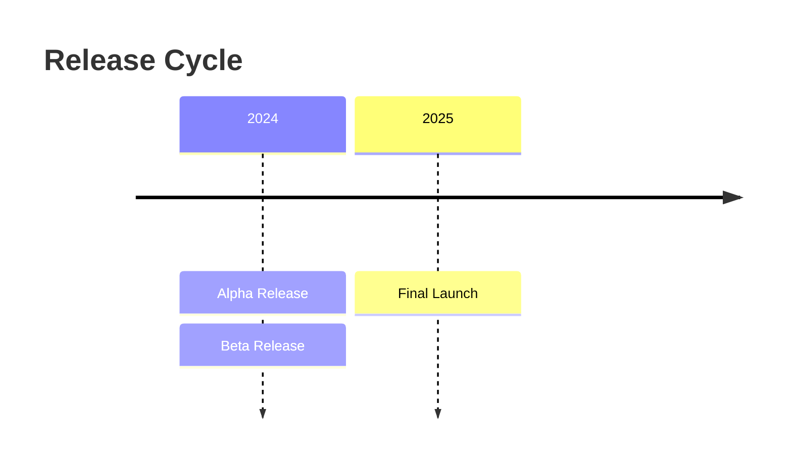
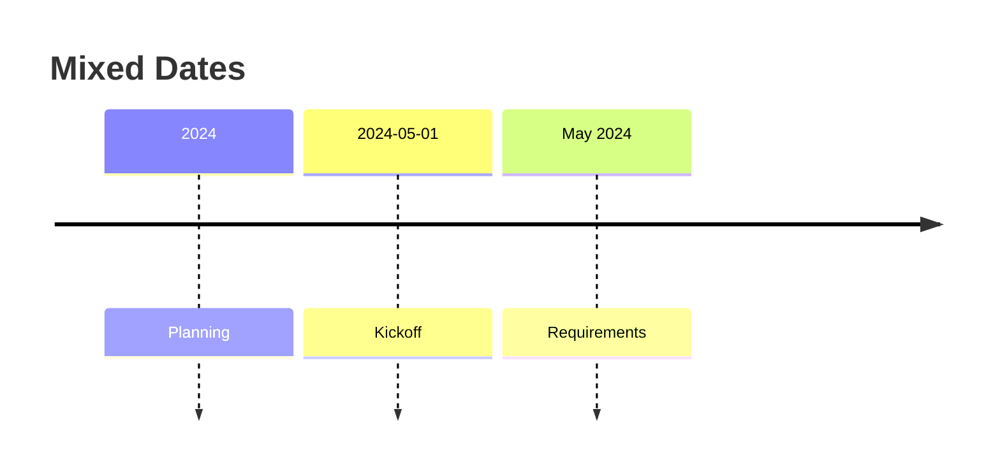
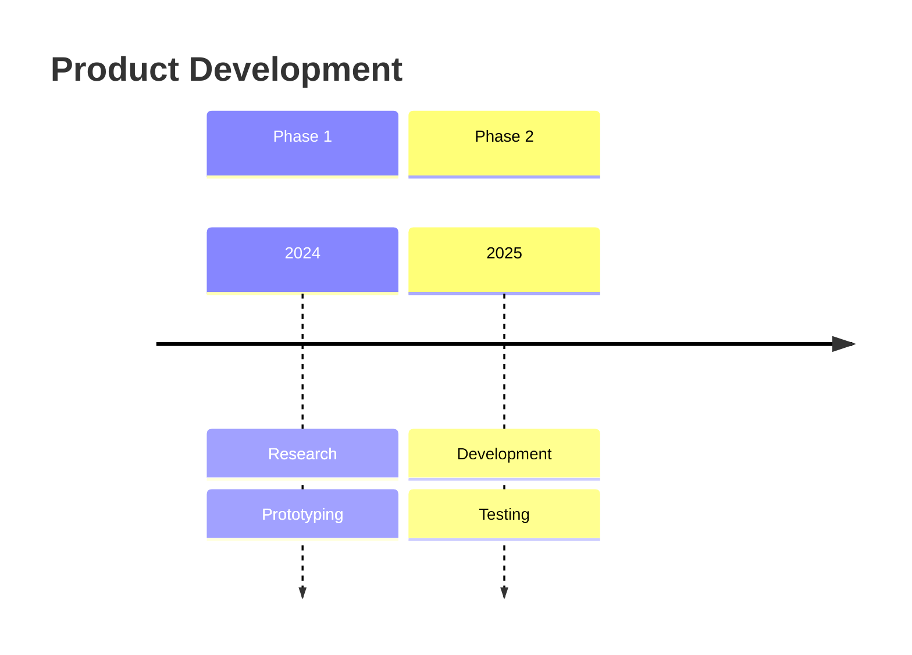
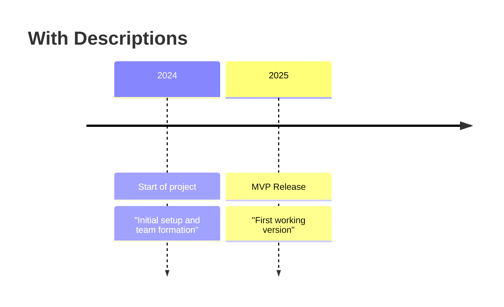

> [!NOTE] Documentation  
> [Timeline | Mermaid](https://mermaid.js.org/syntax/timeline.html)

## Minimal Timeline



## Multiple Events in a Single Year



## Multiple Date Formats



## Grouping by Sections



## Styling (Basic)

```mermaid
timeline
    title Styled Example
    2024 : Event A
    2025 : Event B

    class EventA fill:#f9f,stroke:#333
```

## Notes / Descriptions

