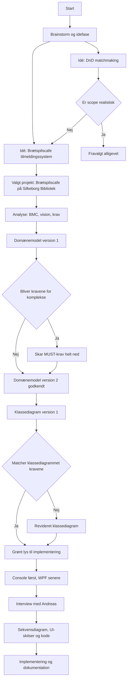

# [[2025-11-18]]
- "Vi valgte at gå med biblioteks casen fremfor DND fordi:
	Vi lagde os næsten fast på en idé (Tilmeldingssystem til brætspilsaften på Silkeborg Bibliotek) længere tids brainstorm. Vi overvejede at lave et matchmaking system til Dungeons and Dragons, men lagde os fast på den anden idé fordi vi var bange for at gå ud af vores scope og det derved hurtigt blev alt for omfattende til et 4 ugers projekt."
- Vi lavede gruppekontrakt
- Vi har valgt at bruge Obsidian, Typst.
- Vi har droppet Git-plugin til Obsidian da det blev for rodet og tog for meget tid.
- Vi har valgt at arbejde ud fra disse principper:
	- Definere nogle arbejds titler fra starten og udfylder dem med udkast løbende gennem projektet.
	- daily session based process logs kilde: 1 Donald Schön’s _Reflective Practitioner_ framework (MIT Press)  
	- descision log kilde: ADR (Architecture Decision Record) format
# [[2025-11-19]]
- Lave første problemformuleringer ud fra biblioteks tekst Kilde: ==Mangler==
- Problemstillinger, Ordbog, Gantt, Første udkast til BMC,
- **Administrator skal kunne sætte datoer samt definere spilbeholdning.**

- 

#  [[2025-11-20]]
- Vi blev enige om [[Command-Query]] og [[DRY]] principperne.
- Beslutter console first then WPF
- Skal vi bygge et system der passer godt til vores afgrænsning (silkeborg bibliotek), eller til et generelt community brugsscenarie?
	- Vi arbejder ud af problemstillinger genereret specifikt ud fra silkeborgbib.
	- Vi genererer use cases specifikt til brætspilscafeen på silkeborgbib.
	- Derfor er vores problemdomæne vores afgrænsede case på silkeborgbib.
	- Vi vil ikke kunne begynde at modellere et problemdomæne udenfor silkeborgbib da det ville være baseret på antagelser.
- Kilder 
	- OsterWalder-Business Model Generation i forhold til BMC  
	- Kilde til The Planning Model i forhold til vores Problemstillinger (Purpose, Principles)
#  [[2025-11-21]]
* Vi har valgt, at administrator skal kunne oprette et arrangement hvori brugere kan oprette eller deltage i spilsessioner.
* Administrator skal kunne se tidligere arrangementer og sessioner imens brugere kun skal kunne se igangværende og kommende.
* Vi har besluttet os for, at vi i vores software er et skridt længere inde i systemet end login, så vi ved at ændre hvilken bruger der bruges kan vises hvilke forskellige rettigheder de har (eks. Administrator, GameMaster, Bruger)
* Vi har valgt at gå med Moscow fremfor FURPS+
* Vi har har besluttet vi kun 3 typer "brugere" (En bruger kan være almindelig bruger, som tilmelder sig et spil og bruger systemet, en bruger kan også oprette en spilsession og blive GameSession til den spilsession, og en bruger kan have administratorrettigheder og oprette arrangementer)

#  [[2025-11-25]]
Løbende med hans gennemgang blev arbejdet itereret over (se [[#Hvilke beslutninger har vi taget? (2)]])
- ==Det er værd at bemærke hvordan vi arbejer med scope/afgrænsning. Vi roder rundt i om vi tager udgangpunkt i vores brætspils-cafe case eller om det er open source tanken (forretningsanalysen) om at systemmet skal kunne bruges i mange forskellige scenarier.==
	- Når vi analysere (BMC, OOA) så er det med udgangspunkt i vores case. Det er der vi afgrænser vores projekt sådan at vi har tid til at få en forståelse som vi kan lave designbeslutninger på baggrund af før tiden er gået.
	- Når vi designer og implementere (OOD og kode) så kan klassediagrammet kun være baseret på den data/indsigt som vi har -> altså vores afgrænsede case. Men navngivningen af klasser kan godt gøres abstrakte sådan at systemmet er forberedt på at kunne videreudvikles til en mere generel brug.
	- Begyndt at bruge begreber fra [[Ordbog]]en direkte i vores design arbejde. Eksempel fra MOSCOW/[[Krav]] ![[Krav#^694f3c]]
- Begyndte at bruge ord fra [[ordbog]]en i vores analyse arbejde, men kom i tanke om at ordene er *code-first* og ikke semantiske, derfor kommer vi til at tænke design når vi skal sidde og analysere. Eksempel fra [[Use cases]] ![[Use cases#^649c42]]
- ==Vores use cases skal nok omskrives sådan at de forbliver åbne og fokuseret på problemdomænet ikke på system interaktionen vi designer.==
-**UI**
- Flytter arrangement/dato side ind som en liste i opret spilsession siden.
	- Hvorfor? Fordi at det simplificere brugeroplevelsen, reducere klik.
- Spilsession listen, skal sessionerne sorteres og grupperes efter dato (ascending)

**Roller og rettigheder**
- Brugere kan oprette spilsessioner. 
- Gamemaster har oprettet spilsession(er) og har rettigheden til at slette sessionen (must) og redigere (should).
- På samme måde som [[Gamemaster]] og [[Session]]s skal en [[Admin]] kunne gå til [[UserProfile]] og rette og slette.

**Systemmets håndtering af arrangementer**
- Arrangementer er et klart element i vores domænemodel og skal tænkes ind i problemdomænet.
- Arrangementer bliver håndteret udenfor vores system (bibliotek website, FB event), og skal derfor ikke implementeres i klassediagrammet.
#  [[2025-11-26]]
Se [[Vejledning med Niels 26-11]]
Dertil er det vigtigste vi udrettede at skære vores krav ind til benet.
#  [[2025-11-27]]

#  [[2025-11-28]]