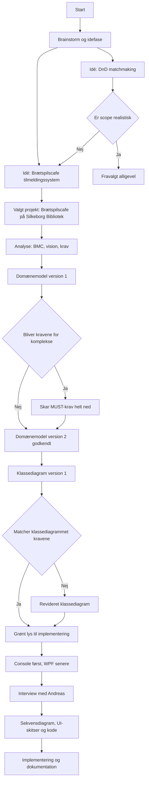

# [[2025-11-18]]
- "Vi valgte at gå med biblioteks casen fremfor DND fordi:
	Vi lagde os næsten fast på en idé (Tilmeldingssystem til brætspilsaften på Silkeborg Bibliotek) længere tids brainstorm. Vi overvejede at lave et matchmaking system til Dungeons and Dragons, men lagde os fast på den anden idé fordi vi var bange for at gå ud af vores scope og det derved hurtigt blev alt for omfattende til et 4 ugers projekt."
- Vi lavede gruppekontrakt
- Vi har valgt at bruge Obsidian, Typst.
- Vi har droppet Git-plugin til Obsidian da det blev for rodet og tog for meget tid.
- Vi har valgt at arbejde ud fra disse principper:
	- Definere nogle arbejds titler fra starten og udfylder dem med udkast løbende gennem projektet.
	- daily session based process logs kilde: 1 Donald Schön’s _Reflective Practitioner_ framework (MIT Press)  
	- descision log kilde: ADR (Architecture Decision Record) format
# [[2025-11-19]]
- Lave første problemformuleringer ud fra biblioteks tekst Kilde: ==Mangler==
- Problemstillinger, Ordbog, Gantt, Første udkast til BMC,
- **Administrator skal kunne sætte datoer samt definere spilbeholdning.**
