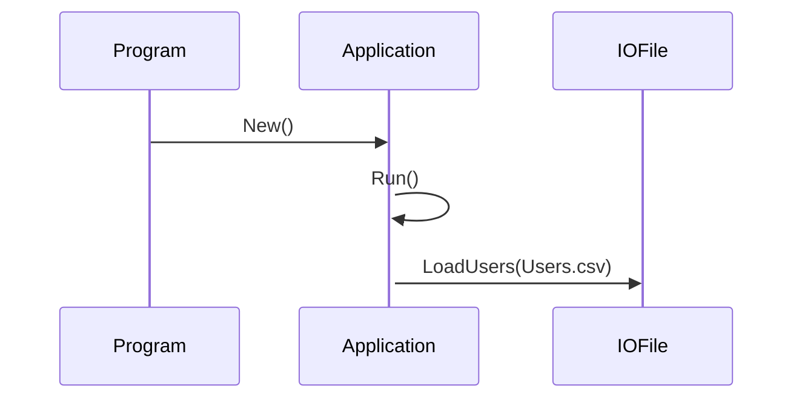

```mermaid

sequenceDiagram
    
    participant P as Program
    participant A as Application
    participant I as IOFile
    
    P->>A: New()
    Activate A
    A->>A: Run()
    
	A->>I: LoadUsers(Users.csv)
	
	
	
    
    


```

