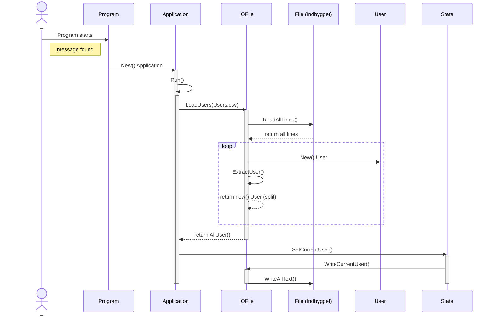

```mermaid

sequenceDiagram
     
    actor _ 
    participant P as Program
    participant A as Application
    participant I as IOFile
    participant F as File (Indbygget)
    participant U as User
    participant S as State
    
    _->>P: Program starts
    Note right of _: message found
    P->>A: New() Application
    Activate A 
    A->>A: Run()
    Activate A
	A->>I: LoadUsers(Users.csv)
    Activate I
	I->>F: ReadAllLines()
	F-->>I: return all lines
	loop 
    I->>U: New() User
	I->>I: ExtractUser()
	I-->>I: return new() User (split)
	end
	I-->>A: return AllUser()
	Deactivate I
	A->>S: SetCurrentUser()
	Activate S
	S->>I: WriteCurrentUser()
	Activate I
	I->>F: WriteAllText()
	Deactivate I
	Deactivate S
	
	Deactivate A
	Deactivate A
	
	
	
    
    


```

