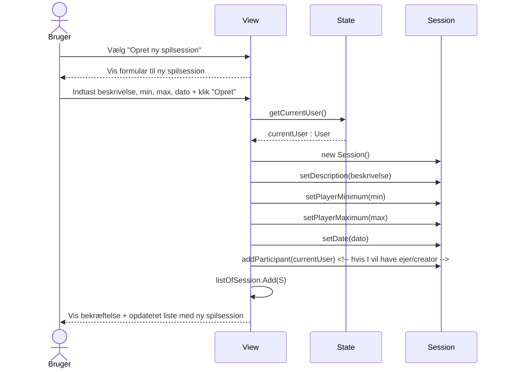
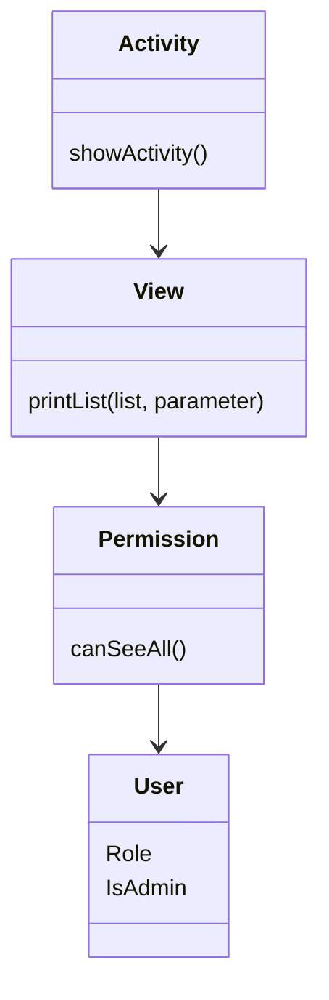

Guide: [[Sequence diagram]]

# Version 1
Er designet med udgangspunkt i [[Klassediagram#Version 3]] og [[Use cases#2. Oprettelse af aktiviteter med mulighed for begrænsning af antal deltagere]]

![[Pasted image 20251127130844.png|500]]