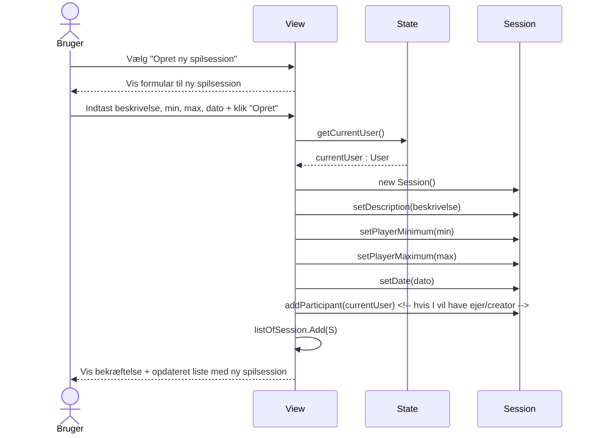
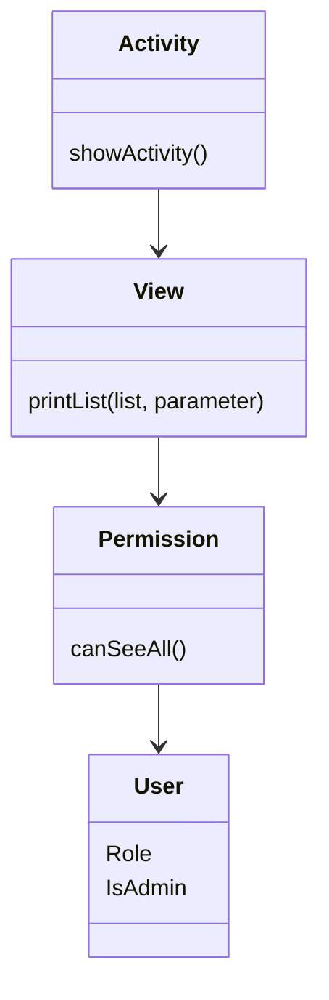
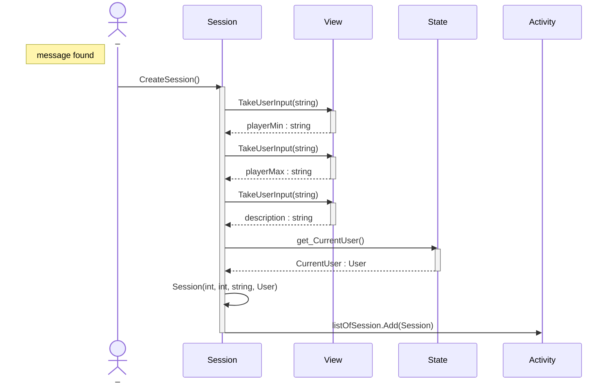
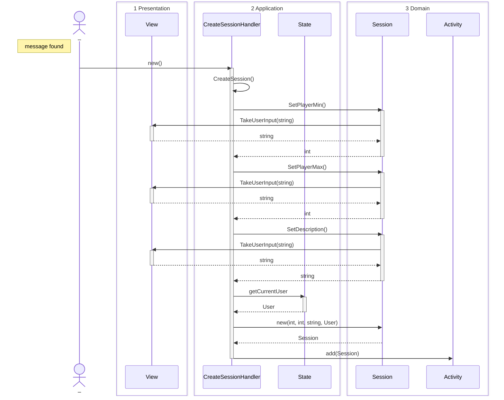

Guide: [[Sequence diagram]]

#### Syntax eksempel

#### Flow ide
Vi bruger [[OO layers]]

# [[Use cases#2. Oprettelse af aktiviteter med mulighed for begrænsning af antal deltagere|Use case 2]]
## Version 1
Er designet med udgangspunkt i [[Klassediagram#Version 3]], men er ajour med [[Klassediagram#Version 4|version 4]] 

## Version 2
Er designet med udgangspunkt i [[Klassediagram#Version 3]], men er ajour med [[Klassediagram#Version 4|version 4]] 
