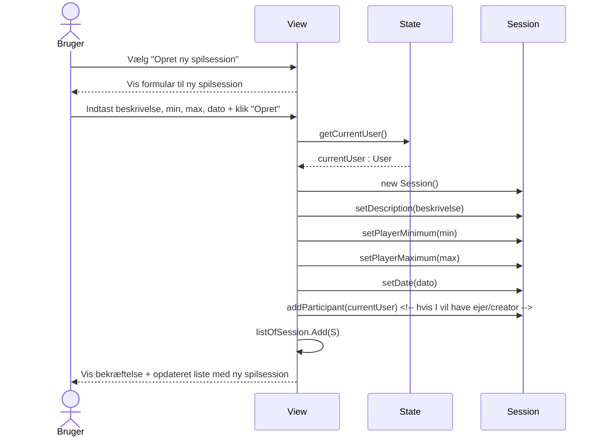
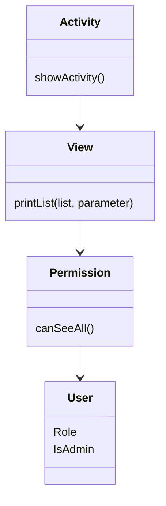
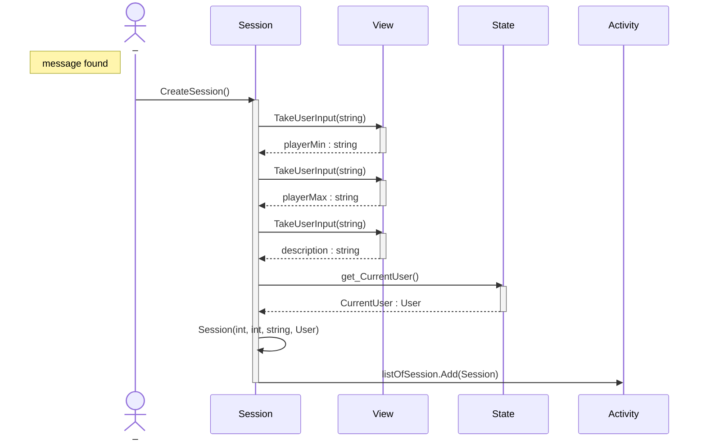
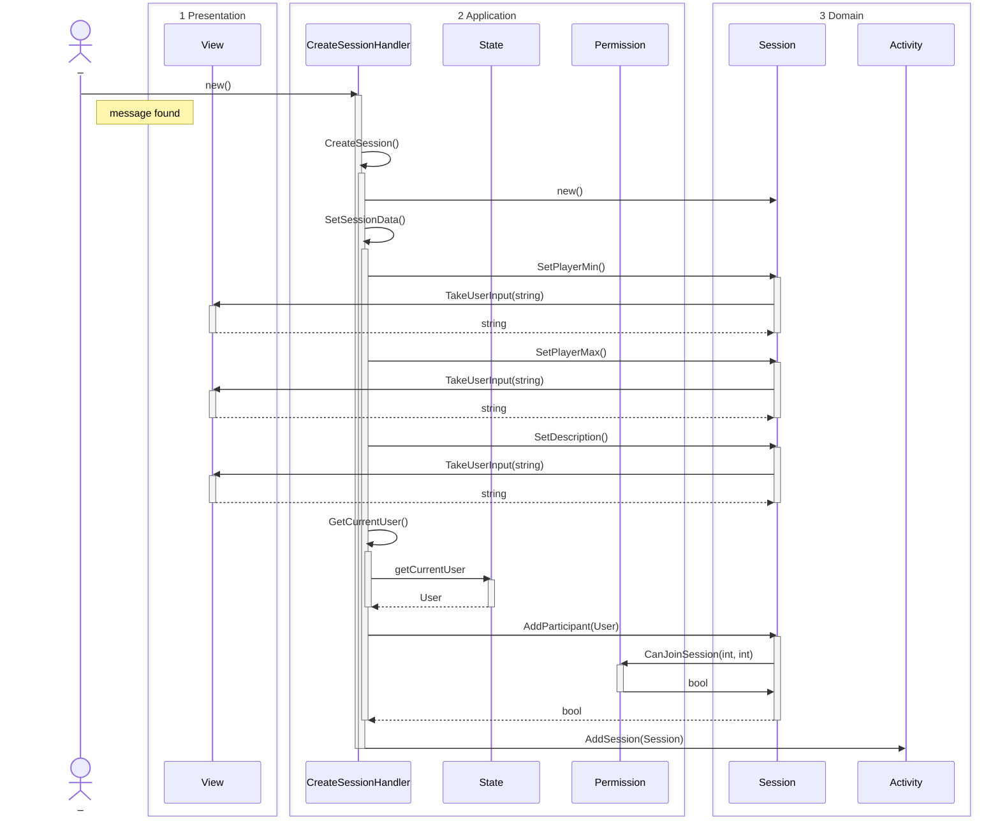
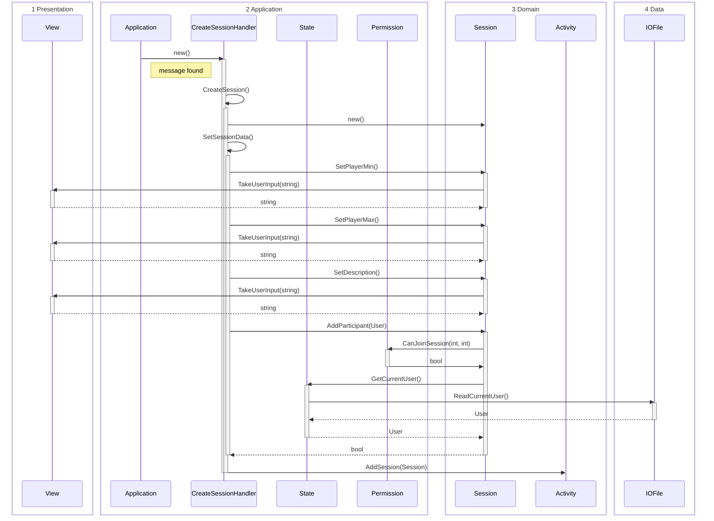
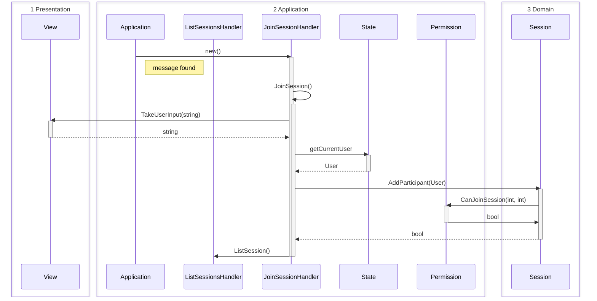
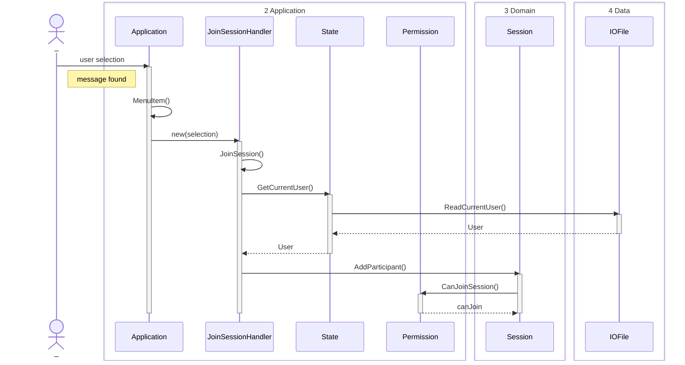
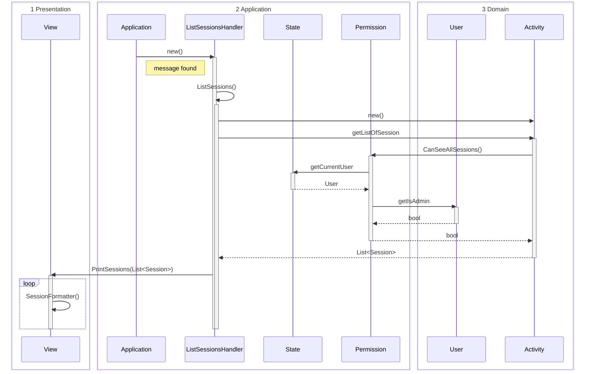
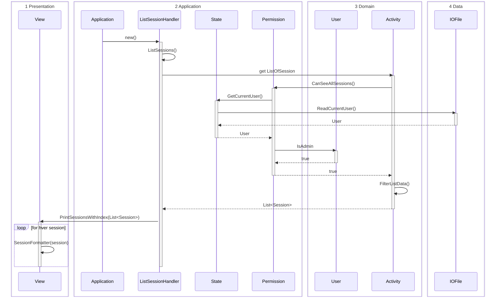
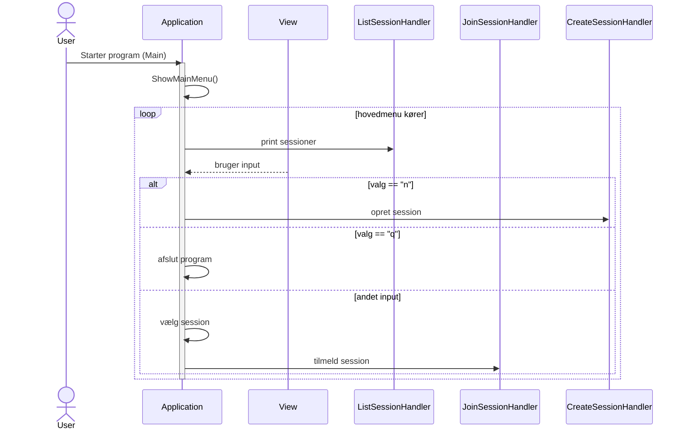

Guide: [[Sequence diagram]]

#### Syntax eksempel

#### Flow ide
Vi bruger [[OO layers]]

# [[Use cases#2. Oprettelse af aktiviteter med mulighed for begrænsning af antal deltagere]]
## Version 1
Er designet med udgangspunkt i [[Klassediagram#Version 3]], men er ajour med [[Klassediagram#Version 4|version 4]] 

## Version 2
Er designet med udgangspunkt i [[Klassediagram#Version 3]], men er ajour med [[Klassediagram#Version 4|version 4]] 

## Version 3

# [[Use cases#3. Tilmelding til aktiviteter]]
## Version 1
Er designet med udgangspunkt i [[Klassediagram#Version 5]].

## Version 2

# Use case 4: ## [Admin](app://obsidian.md/Admin) ser information på tidligere [Session](app://obsidian.md/Session)s 
## Version 1

## [[Version 2]]

# System flow sekvensdiagram 
## Version 1
