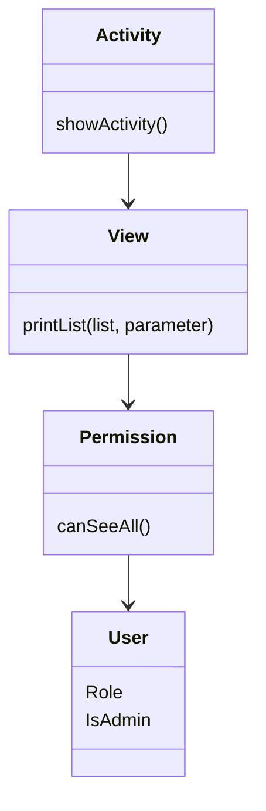

Guide: [[Sequence diagram]]

# Version 1
Er designet med udgangspunkt i [[Klassediagram#Version 3]] og [[Use cases#2. Oprettelse af aktiviteter med mulighed for begrænsning af antal deltagere]]


```mermaid
sequenceDiagram
	actor 
	
	
	
	participant State
	participant User
	
	->State: CreateNewSession
	 
	


```



![[Pasted image 20251127130844.png|500]]