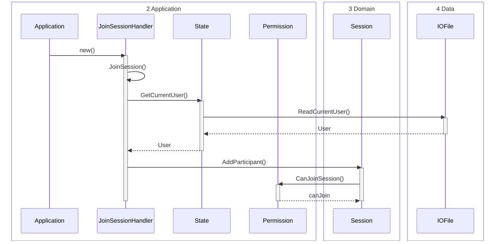
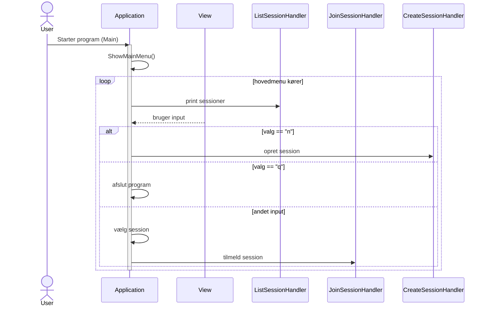

```mermaid
sequenceDiagram

box 2 Application
    participant Application
    participant JoinSessionHandler 
    participant State
    participant Permission
end
box 3 Domain
    participant Session
end
box 4 Data
    participant IOFile
end

%% Opret handler til tilmelding
Application->>JoinSessionHandler: new()
activate JoinSessionHandler
JoinSessionHandler->>JoinSessionHandler: JoinSession()

%% Hent nuværende bruger (via State/IOFile)
JoinSessionHandler->>State: GetCurrentUser()
activate State
State->>IOFile: ReadCurrentUser()
activate IOFile
IOFile-->>State: User
deactivate IOFile
State-->>JoinSessionHandler: User
deactivate State

%% Forsøg at tilføje bruger til Session
JoinSessionHandler->>Session: AddParticipant()
activate Session

Session->>Permission: CanJoinSession()
activate Permission
Permission-->>Session: canJoin
deactivate Permission
deactivate Session

deactivate JoinSessionHandler

```
## Eksempel (blackbox)

```mermaid
sequenceDiagram
    actor User
    participant Application
    participant View
    participant ListSessionHandler
    participant JoinSessionHandler
    participant CreateSessionHandler

    User->>Application: Starter program (Main)
    activate Application

	Application->>Application: ShowMainMenu()

    loop hovedmenu kører
        Application->>ListSessionHandler: print sessioner
        View-->>Application: bruger input
			
        alt valg == "n"
            Application->>CreateSessionHandler: opret session

        else valg == "q"
            Application->>Application: afslut program
        else andet input
			Application->>Application: vælg session
			Application->>JoinSessionHandler: tilmeld session
            
        end
    end

    deactivate Application

```