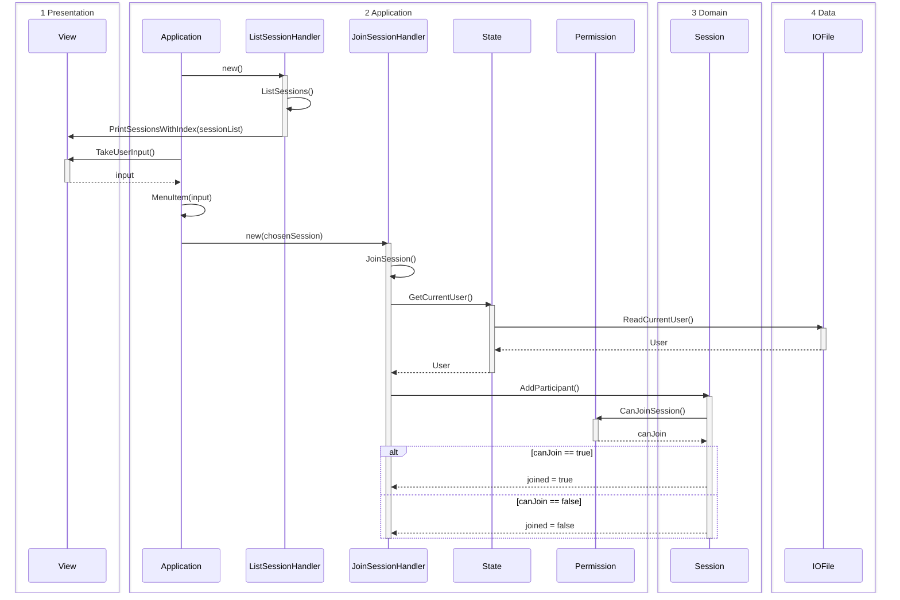
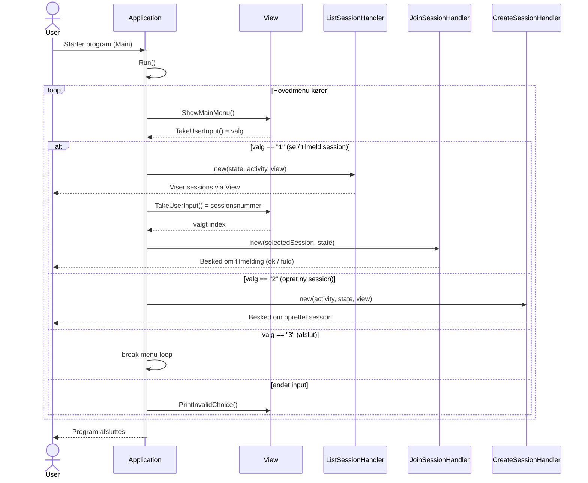

```mermaid
sequenceDiagram

box 1 Presentation
    participant View
end
box 2 Application
    participant Application
    participant ListSessionHandler 
    participant JoinSessionHandler 
    participant State
    participant Permission
end
box 3 Domain
    participant Session
end
box 4 Data
    participant IOFile
end

%% Hovedmenu: vis sessionsliste
Application->>ListSessionHandler: new()
activate ListSessionHandler
ListSessionHandler->>ListSessionHandler: ListSessions()
ListSessionHandler->>View: PrintSessionsWithIndex(sessionList)
deactivate ListSessionHandler

%% Bruger vælger et sessionsnummer
Application->>View: TakeUserInput()
activate View
View-->>Application: input
deactivate View

Application->>Application: MenuItem(input)

%% Opret handler til tilmelding
Application->>JoinSessionHandler: new(chosenSession)
activate JoinSessionHandler
JoinSessionHandler->>JoinSessionHandler: JoinSession()

%% Hent nuværende bruger (via State/IOFile)
JoinSessionHandler->>State: GetCurrentUser()
activate State
State->>IOFile: ReadCurrentUser()
activate IOFile
IOFile-->>State: User
deactivate IOFile
State-->>JoinSessionHandler: User
deactivate State

%% Forsøg at tilføje bruger til Session
JoinSessionHandler->>Session: AddParticipant()
activate Session

Session->>Permission: CanJoinSession()
activate Permission
Permission-->>Session: canJoin
deactivate Permission

alt canJoin == true
    Session-->>JoinSessionHandler: joined = true
else canJoin == false
    Session-->>JoinSessionHandler: joined = false
end
deactivate Session

deactivate JoinSessionHandler

```

```mermaid
sequenceDiagram
    actor User
    participant Application
    participant View
    participant ListSessionHandler
    participant JoinSessionHandler
    participant CreateSessionHandler

    User->>Application: Starter program (Main)
    activate Application

    Application->>Application: Run()

    loop Hovedmenu kører
        Application->>View: ShowMainMenu()
        View-->>Application: TakeUserInput() = valg

        alt valg == "1" (se / tilmeld session)
            Application->>ListSessionHandler: new(state, activity, view)
            ListSessionHandler-->>User: Viser sessions via View

            Application->>View: TakeUserInput() = sessionsnummer
            View-->>Application: valgt index

            Application->>JoinSessionHandler: new(selectedSession, state)
            JoinSessionHandler-->>User: Besked om tilmelding (ok / fuld)
        
        else valg == "2" (opret ny session)
            Application->>CreateSessionHandler: new(activity, state, view)
            CreateSessionHandler-->>User: Besked om oprettet session

        else valg == "3" (afslut)
            Application->>Application: break menu-loop

        else andet input
            Application->>View: PrintInvalidChoice()
        end
    end

    Application-->>User: Program afsluttes
    deactivate Application

```