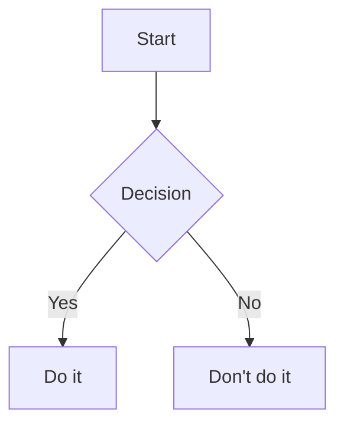

# 📝 Markdown & Obsidian Syntax Guide for Beginners

Welcome to Markdown and Obsidian! This guide covers the most essential syntax for writing notes, documentation, and diagrams.

---

## 1. Headings

Use `#` for headings:

```markdown
# Heading 1
## Heading 2
### Heading 3
```

---

## 2. Text Formatting

```markdown
**Bold text**

*Italic text*

~~Strikethrough~~
```

---

## 3. Lists

### Unordered List

```markdown
- Item 1
- Item 2
  - Subitem
```

### Ordered List

```markdown
1. First item
2. Second item
```

---

## 4. Links and Images

```markdown
[Link text](https://example.com)


```

---

## 5. Code Blocks and Inline Code

### Inline Code

```markdown
Use `backticks` for inline code.
```

### Code Block

<pre>
```python
def hello():
    print("Hello, world!")
```
</pre>

---

## 6. Blockquotes

```markdown
> This is a quote.
```

---

## 7. Horizontal Rule

```markdown
---
```

---

## 8. Tables

```markdown
| Name   | Role     |
|--------|----------|
| Alice  | Designer |
| Bob    | Developer |
```

---

## 9. Task Lists

```markdown
- [ ] To do item
- [x] Completed item
```

---

## 10. Internal Links (Obsidian)

```markdown
[[Another Note]]
```

Links to another note in your vault.

---

## 11. Tags (Obsidian)

```markdown
#project
#meeting/notes
```

Tags help organize and filter notes.

---

## 12. Embedding Notes and Files (Obsidian)

```markdown
![[Another Note]]
![[image.png]]
```

Embeds another note or image directly into the current note.

---

## 13. Mermaid Diagrams



Use for flowcharts, sequence diagrams, and more. See [[Mermaid guide]].

---

Happy writing! 🎉
